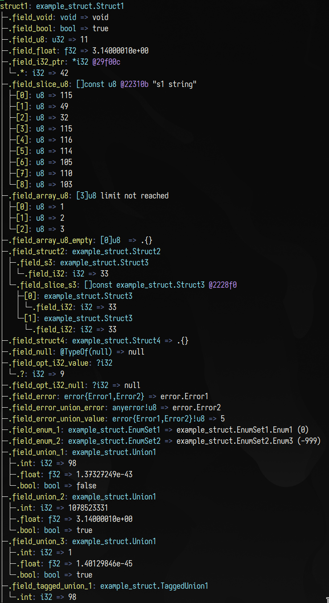

# Tree Formattar for Zig
- Pretty prints out Zig Values for your debugging needs.
- If you faces any issue with formatting, kindly open an issue.

## Versioning
- see tags
- current version: `v0.12.0-dev.2150+63de8a598`

## Objective
- Provide a colored tree-like visual representation of a Zig value to aid in debugging.

## Features
- Colored output to distinguish between types and values
- Indentation to show the structure of the value
- Special formatters for following types, do file a PR or FR if you think there are more types that can support special formatting:
  - `std.MultiArrayList`
  - `std.HashMapUnmanaged`

## Screenshot


## Usage
- Zig Package Manager Example: https://github.com/speed2exe/tree-fmt-example
- `zig.build.zon`
```zon
.{
    .name = "your_package_name",
    .version = "0.0.1",
    .dependencies = .{
        .tree_fmt = .{
            .url = "https://github.com/speed2exe/tree-fmt/archive/8e35205734e6dea7c0fd66c8a9f645d87558f68c.tar.gz",
            .hash = "12201dceb9a9c2c9a6fc83105a7f408132b9ab69173b266e7df2af2c1dd6f814cd51",
        },
    },
    .paths = .{ "" },
}
```
- `build.zig`
```zig
pub fn build(b: *std.Build) void {
    // ...
    const dep = b.dependency("tree_fmt", .{});
    const tree_fmt = dep.module("tree-fmt");
    your_program.root_module.addImport("tree-fmt", tree_fmt);
}
```

### Quick Setup
- This is the easiest way if you want to save time.
- This example is in `example_default_tree_formatter.zig`

```zig
var tree_formatter = @import("tree-fmt").defaultFormatter();

pub fn main() !void {
    try tree_formatter.format(.{ 1, 2.4, "hi" }, .{
        .name = "my_anon_struct",
    });
}
```
- Output:
```
some_anon_struct: tuple{comptime comptime_int = 1, comptime comptime_float = 2.4, comptime *const [2:0]u8 = "hi"}
├─.0: comptime_int => 1
├─.1: comptime_float => 2.4e+00
└─.2: *const [2:0]u8 @21d169
  └─.*: [2:0]u8 hi
    ├─[0]: u8 => 104
    └─[1]: u8 => 105
```


### Proper Setup
- This is recommended, as it gives you more control over writer, allocator and settings.

```zig
const std = @import("std");

// add imports here
const treeFormatter = @import("tree-fmt").treeFormatter;

pub fn main() !void {
    // initialize your allocator
    var gpa = std.heap.GeneralPurposeAllocator(.{}){};
    const allocator = gpa.allocator();
    defer {
        const leaked = gpa.deinit();
        if (leaked) {
            @panic("leaked memory!");
        }
    }

    // initialize a writer (std.io.Writer)
    // tips if you print a lot: wrap with std.io.BufferedWriter to improve performance
    var w = std.io.getStdOut().writer();

    // initialize TreeFormatter with allocator and writer
    var tree_formatter = treeFormatter(allocator, w);

    // initialize your value
    var sentinel_array: [*:0]const u8 = "hello world";

    // call the method with writer and value
    try tree_formatter.formatValueWithId(sentinel_array, .{
        // .name = "sentinel_array", <-- example setting
        // you can find settings at @import("./src/tree_fmt.zig").TreeFormatterSettings;
        // you can also leave it blank to use default settings
    });
}
```

- Output:
```
sentinel_array: [*:0]const u8 @20a71e "hello world"
├─[0]: u8 => 104
├─[1]: u8 => 101
├─[2]: u8 => 108
├─[3]: u8 => 108
├─[4]: u8 => 111
├─[5]: u8 => 32
├─[6]: u8 => 119
├─[7]: u8 => 111
├─[8]: u8 => 114
├─[9]: u8 => 108
└─... (showed first 10 out of 11 items only)
```

- You can find other examples in the root directory. To run the examples, use
  `zig run examples_<example_name>.zig`

## Example
- `std.ArrayList(u8)`
```
.: array_list.ArrayListAligned(u8,null)
├─.items: []u8 @7efcc912f000
│ ├─[0]: u8 => 0
│ ├─[1]: u8 => 1
│ ├─[2]: u8 => 2
│ ├─[3]: u8 => 3
│ ├─[4]: u8 => 4
│ └─... (showed first 5 out of 100 items only)
├─.capacity: usize => 105
└─.allocator: mem.Allocator
  ├─.ptr: *anyopaque @7fffadc5b3d8
  └─.vtable: *const mem.Allocator.VTable @202a38
    └─.*: mem.Allocator.VTable
      ├─.alloc: *const fn(*anyopaque, usize, u8, usize) ?[*]u8 @238e00
      ├─.resize: *const fn(*anyopaque, []u8, u8, usize, usize) bool @2393c0
      └─.free: *const fn(*anyopaque, []u8, u8, usize) void @23a2d0
```

- `std.AutoHashMap(u8, u8)`
```
map: hash_map.HashMap(u8,u8,hash_map.AutoContext(u8),80)
├─.unmanaged: hash_map.HashMapUnmanaged(u8,u8,hash_map.AutoContext(u8),80)
│ ├─.iterator()
│ │ ├─.next(): hash_map.HashMapUnmanaged(u8,u8,hash_map.AutoContext(u8),80).Entry
│ │ │ ├─.key_ptr: *u8 @7fcad47f5021
│ │ │ │ └─.*: u8 => 1
│ │ │ └─.value_ptr: *u8 @7fcad47f5029
│ │ │   └─.*: u8 => 2
│ │ ├─.next(): hash_map.HashMapUnmanaged(u8,u8,hash_map.AutoContext(u8),80).Entry
│ │ │ ├─.key_ptr: *u8 @7fcad47f5022
│ │ │ │ └─.*: u8 => 0
│ │ │ └─.value_ptr: *u8 @7fcad47f502a
│ │ │   └─.*: u8 => 0
│ │ └─.next(): hash_map.HashMapUnmanaged(u8,u8,hash_map.AutoContext(u8),80).Entry
│ │   ├─.key_ptr: *u8 @7fcad47f5026
│ │   │ └─.*: u8 => 2
│ │   └─.value_ptr: *u8 @7fcad47f502e
│ │     └─.*: u8 => 4
│ ├─.metadata: ?[*]hash_map.HashMapUnmanaged(u8,u8,hash_map.AutoContext(u8),80).Metadata
│ │ └─.?: [*]hash_map.HashMapUnmanaged(u8,u8,hash_map.AutoContext(u8),80).Metadata @7fcad47f5018
│ ├─.size: u32 => 3
│ └─.available: u32 => 3
├─.allocator: mem.Allocator
│ ├─.ptr: *anyopaque @7ffc3b6baca0
│ └─.vtable: *const mem.Allocator.VTable @2045b8
│   └─.*: mem.Allocator.VTable
│     ├─.alloc: *const fn(*anyopaque, usize, u8, usize) ?[*]u8 @2433a0
│     ├─.resize: *const fn(*anyopaque, []u8, u8, usize, usize) bool @243960
│     └─.free: *const fn(*anyopaque, []u8, u8, usize) void @244870
└─.ctx: hash_map.AutoContext(u8) => .{}
```

- `std.MultiArrayList...` (see `example_multi_array_list.zig`)
```
multi_array_list: multi_array_list.MultiArrayList(example_multi_array_list.Person)
├─.slice(): multi_array_list.MultiArrayList(example_multi_array_list.Person).Slice
│ └─.items
│   ├─(.id): []u64 @7f8cf20c3000
│   │ ├─[0]: u64 => 0
│   │ ├─[1]: u64 => 1
│   │ ├─[2]: u64 => 2
│   │ ├─[3]: u64 => 3
│   │ ├─[4]: u64 => 4
│   │ └─... (showed first 5 out of 7 items only)
│   ├─(.age): []u8 @7f8cf20c3080
│   │ ├─[0]: u8 => 0
│   │ ├─[1]: u8 => 1
│   │ ├─[2]: u8 => 2
│   │ ├─[3]: u8 => 3
│   │ ├─[4]: u8 => 4
│   │ └─... (showed first 5 out of 7 items only)
│   └─(.car): []example_multi_array_list.Car @7f8cf20c3040
│     ├─[0]: example_multi_array_list.Car
│     │ └─.license_plate_no: u64 => 555
│     ├─[1]: example_multi_array_list.Car
│     │ └─.license_plate_no: u64 => 555
│     ├─[2]: example_multi_array_list.Car
│     │ └─.license_plate_no: u64 => 555
│     ├─[3]: example_multi_array_list.Car
│     │ └─.license_plate_no: u64 => 555
│     ├─[4]: example_multi_array_list.Car
│     │ └─.license_plate_no: u64 => 555
│     └─... (showed first 5 out of 7 items only)
├─.get
│ ├─(0): example_multi_array_list.Person
│ │ ├─.id: u64 => 0
│ │ ├─.age: u8 => 0
│ │ └─.car: example_multi_array_list.Car
│ │   └─.license_plate_no: u64 => 555
│ ├─(1): example_multi_array_list.Person
│ │ ├─.id: u64 => 1
│ │ ├─.age: u8 => 1
│ │ └─.car: example_multi_array_list.Car
│ │   └─.license_plate_no: u64 => 555
│ ├─(2): example_multi_array_list.Person
│ │ ├─.id: u64 => 2
│ │ ├─.age: u8 => 2
│ │ └─.car: example_multi_array_list.Car
│ │   └─.license_plate_no: u64 => 555
│ ├─(3): example_multi_array_list.Person
│ │ ├─.id: u64 => 3
│ │ ├─.age: u8 => 3
│ │ └─.car: example_multi_array_list.Car
│ │   └─.license_plate_no: u64 => 555
│ └─... (showed first 4 out of 7 items only)
├─.bytes: [*]align(8) u8 @7f8cf20c3000
├─.len: usize => 7
└─.capacity: usize => 8
```

- `multi_array_list.MultiArrayList(zig.Ast.TokenList__struct_4206).Slice`
```
ast: multi_array_list.MultiArrayList(zig.Ast.TokenList__struct_4200).Slice
├─.toMultiArrayList(): multi_array_list.MultiArrayList(zig.Ast.TokenList__struct_4200)
│ ├─.slice(): multi_array_list.MultiArrayList(zig.Ast.TokenList__struct_4200).Slice
│ │ └─.items
│ │   ├─(.tag): []zig.tokenizer.Token.Tag @7ff3c81f7098
│ │   │ ├─[0]: zig.tokenizer.Token.Tag => zig.tokenizer.Token.Tag.keyword_const (86)
│ │   │ ├─[1]: zig.tokenizer.Token.Tag => zig.tokenizer.Token.Tag.identifier (2)
│ │   │ ├─[2]: zig.tokenizer.Token.Tag => zig.tokenizer.Token.Tag.equal (12)
│ │   │ ├─[3]: zig.tokenizer.Token.Tag => zig.tokenizer.Token.Tag.builtin (7)
│ │   │ ├─[4]: zig.tokenizer.Token.Tag => zig.tokenizer.Token.Tag.l_paren (16)
│ │   │ └─... (showed first 5 out of 31 items only)
│ │   └─(.start): []u32 @7ff3c81f7000
│ │     ├─[0]: u32 => 1
│ │     ├─[1]: u32 => 7
│ │     ├─[2]: u32 => 11
│ │     ├─[3]: u32 => 13
│ │     ├─[4]: u32 => 20
│ │     └─... (showed first 5 out of 31 items only)
│ ├─.get
│ │ ├─(0): zig.Ast.TokenList__struct_4200
│ │ │ ├─.tag: zig.tokenizer.Token.Tag => zig.tokenizer.Token.Tag.keyword_const (86)
│ │ │ └─.start: u32 => 1
│ │ ├─(1): zig.Ast.TokenList__struct_4200
│ │ │ ├─.tag: zig.tokenizer.Token.Tag => zig.tokenizer.Token.Tag.identifier (2)
│ │ │ └─.start: u32 => 7
│ │ ├─(2): zig.Ast.TokenList__struct_4200
│ │ │ ├─.tag: zig.tokenizer.Token.Tag => zig.tokenizer.Token.Tag.equal (12)
│ │ │ └─.start: u32 => 11
│ │ ├─(3): zig.Ast.TokenList__struct_4200
│ │ │ ├─.tag: zig.tokenizer.Token.Tag => zig.tokenizer.Token.Tag.builtin (7)
│ │ │ └─.start: u32 => 13
│ │ ├─(4): zig.Ast.TokenList__struct_4200
│ │ │ ├─.tag: zig.tokenizer.Token.Tag => zig.tokenizer.Token.Tag.l_paren (16)
│ │ │ └─.start: u32 => 20
│ │ └─... (showed first 5 out of 31 items only)
│ ├─.bytes: [*]align(4) u8 @7ff3c81f7000
│ ├─.len: usize => 31
│ └─.capacity: usize => 38
├─.ptrs: [2][*]u8
│ ├─[0]: [*]u8 @7ff3c81f7098
│ └─[1]: [*]u8 @7ff3c81f7000
├─.len: usize => 31
└─.capacity: usize => 38
```
